# Projeto - Cidades ESG Inteligentes | TeamHeart

Aplicação Spring Boot desenvolvida no contexto ESG, com foco em autenticação de usuários, gestão de feedbacks internos, cadastro de funcionários e fluxo de recrutamento e seleção com priorização de diversidade.

## Estrutura do projeto

```text
teamheart/
├── .github/workflows/maven.yml
├── Dockerfile
├── docker-compose.yml
├── .env.example
├── README.md
├── render.yaml
└── src/
```

## Como executar localmente com Docker

### Pré-requisitos
- Docker Desktop instalado (inclui Docker e Docker Compose)
- Docker Desktop em execução
- Acesso ao banco Oracle utilizado pela disciplina

### Passos
1. Copie o arquivo `.env.example` para `.env`:
```bash
cp .env.example .env
```

### Arquivo de variáveis de ambiente

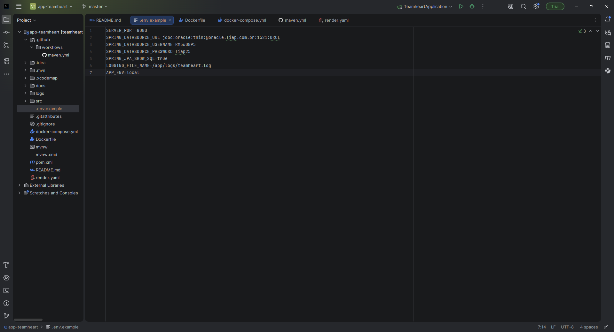

O projeto utiliza variáveis de ambiente para configuração da conexão com o banco Oracle.
Para fins acadêmicos e para facilitar a execução do projeto pelo avaliador, o arquivo .env.example foi disponibilizado já preenchido com os valores necessários para execução no ambiente da disciplina.
Em um cenário real de produção, essas credenciais não deveriam ser versionadas no repositório.

2. Suba a aplicação:
   ```bash
   docker compose up --build
   ```

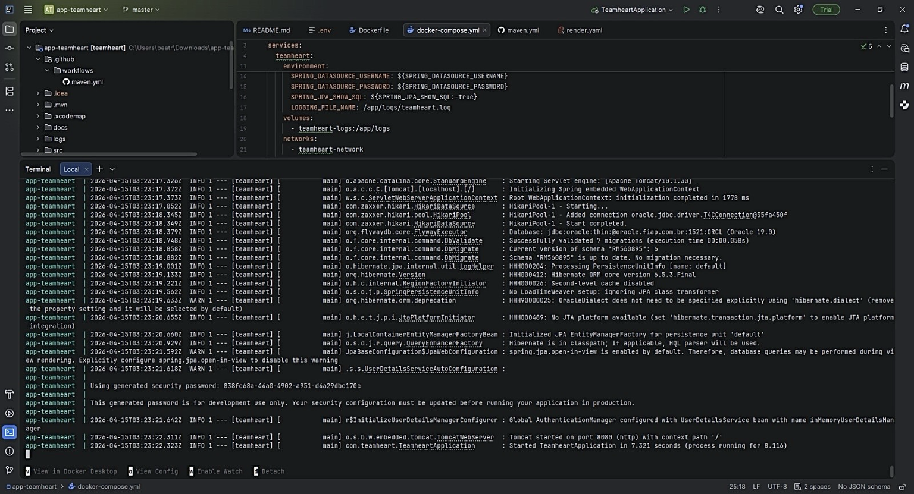

3. A aplicação ficará disponível em:
   - API: `http://localhost:8080`
   - Swagger: `http://localhost:8080/swagger-ui/index.html`

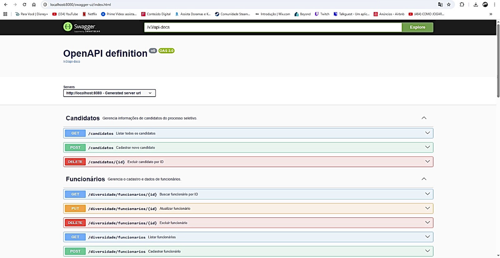

### Observações importantes
- O projeto utiliza banco Oracle externo da disciplina, por isso o `docker-compose.yml` orquestra a aplicação e a configuração do ambiente, sem subir um banco local.
- Os logs da aplicação são persistidos em volume Docker nomeado: `teamheart-logs`.
- A rede do serviço é criada explicitamente como `teamheart-network`.

## Pipeline CI/CD

A automação foi implementada com **GitHub Actions**.

### Ferramenta utilizada
- GitHub Actions
- Render para hospedagem dos ambientes reais
- Docker para empacotamento da aplicação

### Etapas do pipeline

1. **Build**
   - Checkout do repositório
   - Configuração do Java 21
   - Execução de `./mvnw -B clean verify`
   - Geração do artefato `.jar`

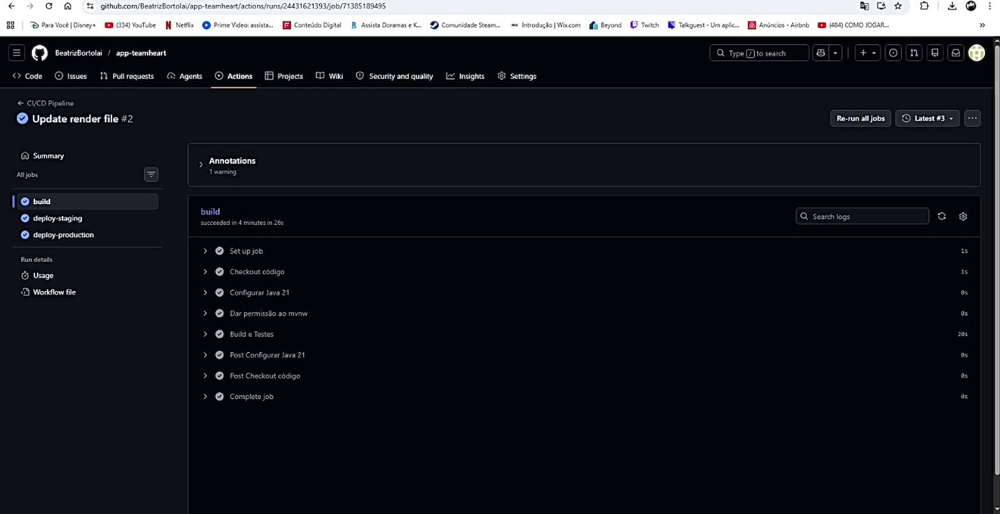

2. **Deploy em staging**
   - Disparo do **Deploy Hook** do Render para o serviço `teamheart-staging`
   - Publicação automática do ambiente de staging no Render

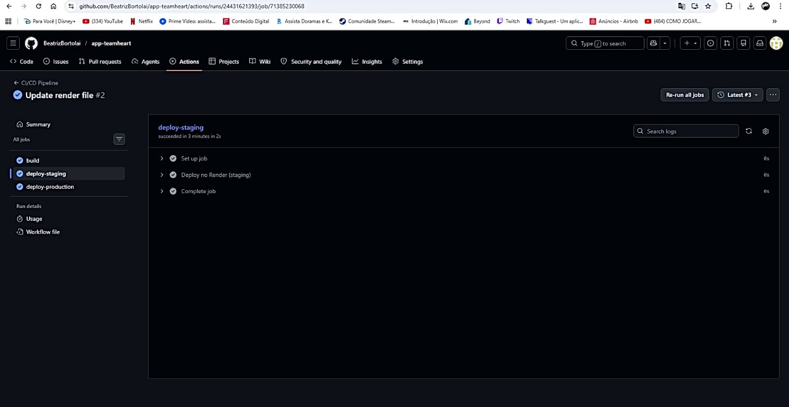

3. **Deploy em produção**
   - Disparo do **Deploy Hook** do Render para o serviço `teamheart-production`
   - Publicação automática do ambiente de produção no Render

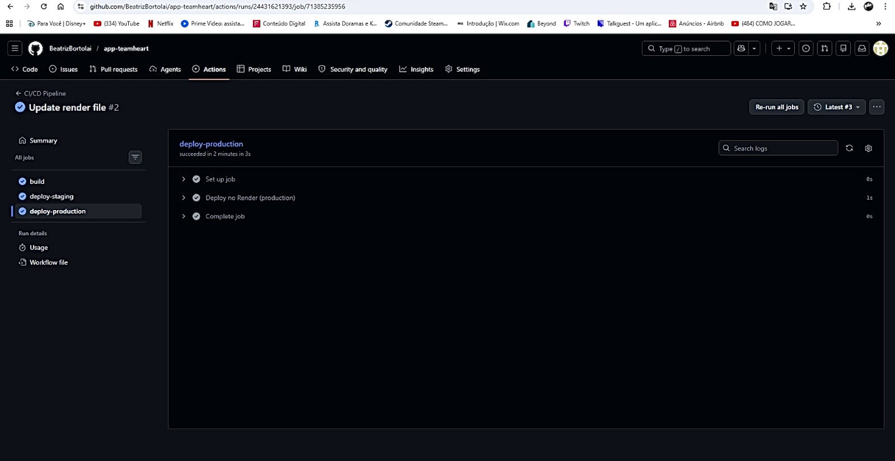

### Funcionamento do pipeline
O workflow foi separado em três jobs:
- um job de integração continua (`build`)
- um job de deploy real para **staging** via Render Deploy Hook
- um job de deploy real para **production** via Render Deploy Hook

### Arquivo de pipeline
- `.github/workflows/maven.yml`

  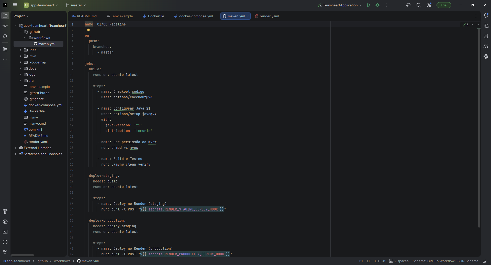

## Deploy real no Render

Este projeto foi preparado para **deploy real** no Render com dois ambientes:
- `teamheart-staging`
- `teamheart-production`

### Ambiente staging no Render

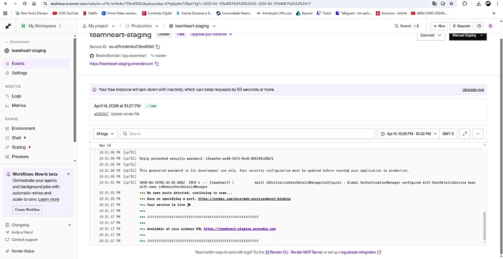

### Swagger staging

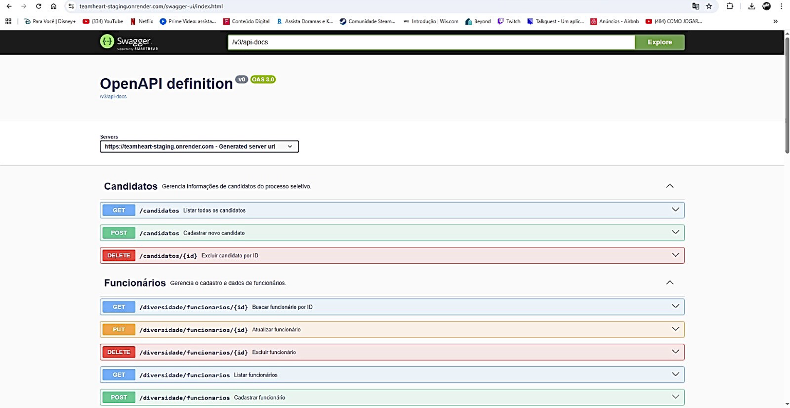

### Ambiente produção no Render

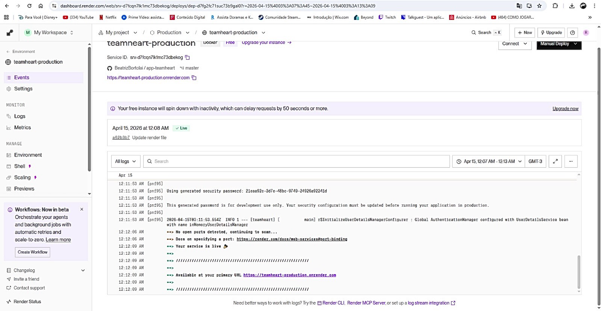

### Swagger produção

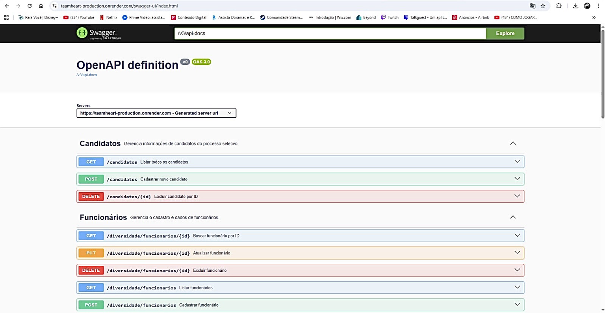

### Arquivos adicionados
- `render.yaml`: define os dois serviços web no Render
- `.github/workflows/maven.yml`: dispara os deploy hooks de staging e produção

### Configuração do deploy (GitHub e Render)

O deploy automatizado foi configurado utilizando integração entre GitHub Actions e Render.

No GitHub, foram utilizados secrets para armazenar os deploy hooks de cada ambiente:
- `RENDER_STAGING_DEPLOY_HOOK`
- `RENDER_PRODUCTION_DEPLOY_HOOK`

Esses hooks são responsáveis por acionar o deploy automático no Render durante a execução do pipeline.

No Render, cada ambiente possui variáveis de ambiente próprias, incluindo:
- `SPRING_DATASOURCE_URL`
- `SPRING_DATASOURCE_USERNAME`
- `SPRING_DATASOURCE_PASSWORD`
- `SERVER_PORT`

### Observação importante

O Render não utiliza `docker-compose.yml` diretamente para publicação dos serviços.  
Para o deploy, foi utilizado o arquivo `render.yaml`, que define os serviços da aplicação utilizando o conceito de **Blueprints**.

A aplicação é construída a partir do `Dockerfile` e configurada por meio de variáveis de ambiente no próprio painel do Render, permitindo a separação entre os ambientes de **staging** e **produção**.

## Containerização
### Containers em execução

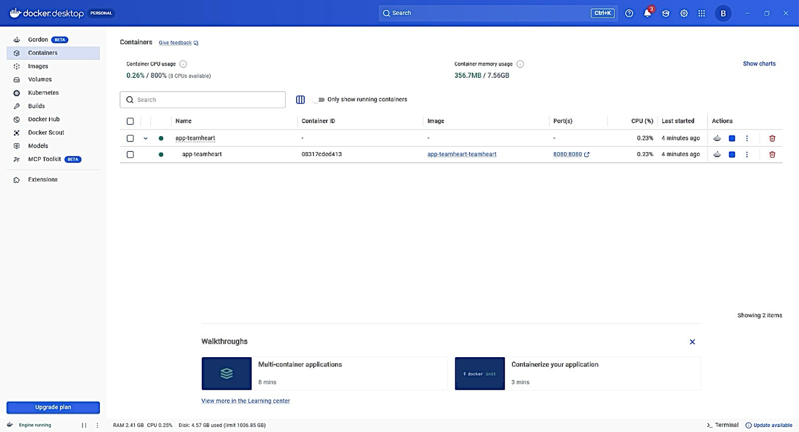

### Estrategia do Dockerfile
O projeto utiliza **multi-stage build**:
- **Stage 1:** compila e empacota a aplicação com Maven
- **Stage 2:** executa apenas o `.jar` final em imagem Java 21 mais enxuta

### Dockerfile utilizado
```dockerfile
FROM maven:3.9.9-eclipse-temurin-21 AS build
WORKDIR /app
COPY .mvn .mvn
COPY mvnw pom.xml ./
RUN chmod +x mvnw && ./mvnw dependency:go-offline -B
COPY src ./src
RUN ./mvnw clean package -DskipTests

FROM eclipse-temurin:21-jre
WORKDIR /app
COPY --from=build /app/target/*.jar app.jar
EXPOSE 8080
ENTRYPOINT ["java", "-jar", "app.jar"]
```

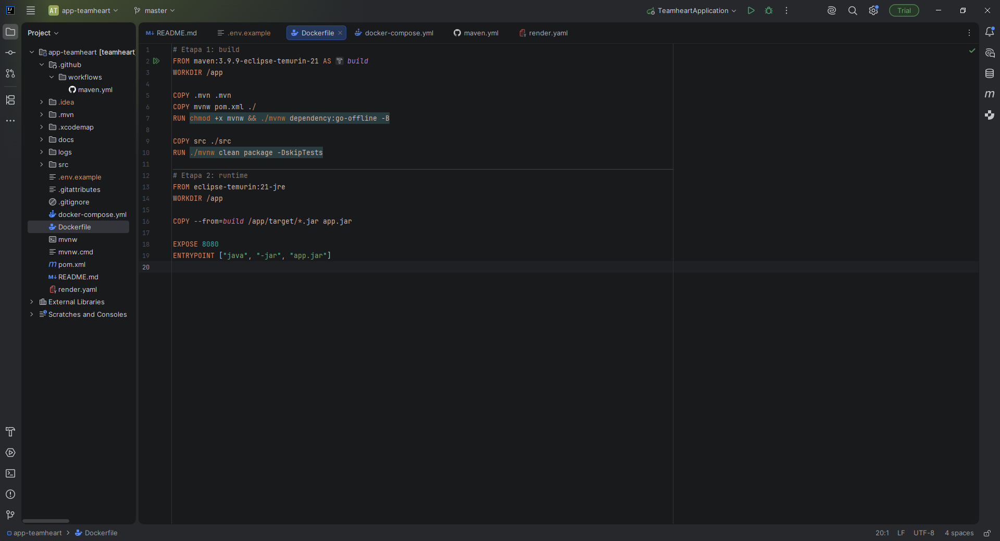

### Docker Compose
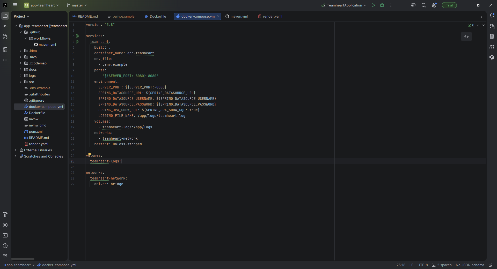

### Estrategias adotadas
- Multi-stage build para reduzir a imagem final
- Externalização de segredos via `.env`
- Aplicação exposta localmente na porta 8080
- Volume nomeado para logs
- Rede Docker explicita
- Separação dos ambientes `staging` e `production` via Render e variáveis de ambiente

## Tecnologias utilizadas

- Java 21
- Spring Boot 3.3.4
- Spring Web
- Spring Data JPA
- Spring Security
- Spring Validation
- Oracle Database
- Flyway
- Swagger / OpenAPI
- Maven Wrapper
- Docker
- Docker Compose
- GitHub Actions
- Render
- JUnit 5
- Mockito


## Checklist de Entrega

| Item                                                | OK |
|-----------------------------------------------------|---|
| Projeto compactado em .ZIP com estrutura organizada | ☒ |
| Dockerfile funcional                                | ☒ |
| docker-compose.yml ou arquivos Kubernetes           | ☒ |
| Pipeline com etapas de build, teste e deploy        | ☒ |
| README.md com instruções e prints                   | ☒ |
| Documentação técnica com evidências (PDF ou PPT)    | ☒ |
| Deploy realizado nos ambientes staging e produção   | ☒ |

