# Projeto - TeamHeart

Aplicação Spring Boot desenvolvida no contexto ESG, com foco em autenticação de usuários, gestão de feedbacks internos, cadastro de funcionários e fluxo de recrutamento e seleção com priorização de diversidade.

## Estrutura do projeto

```text
teamheart/
├── .github/workflows/maven.yml
├── Dockerfile
├── docker-compose.yml
├── .env.example
├── README.md
├── render.yaml
└── src/
```

## Como executar localmente com Docker

### Pré-requisitos
- Docker Desktop instalado (inclui Docker e Docker Compose)
- Docker Desktop em execução
- Acesso ao banco Oracle utilizado pela disciplina

### Passos
1. Copie o arquivo `.env.example` para `.env`:
```bash
cp .env.example .env
```

### Arquivo de variáveis de ambiente

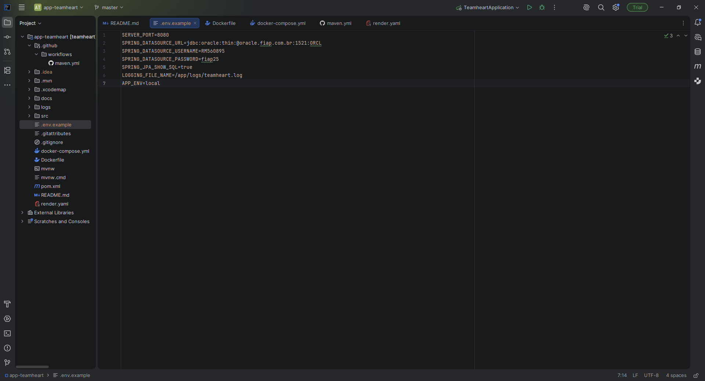

O projeto utiliza variáveis de ambiente para configuração da conexão com o banco Oracle.
Para fins acadêmicos e para facilitar a execução do projeto pelo avaliador, o arquivo .env.example foi disponibilizado já preenchido com os valores necessários para execução no ambiente da disciplina.
Em um cenário real de produção, essas credenciais não deveriam ser versionadas no repositório.

2. Suba a aplicação:
   ```bash
   docker compose up --build
   ```

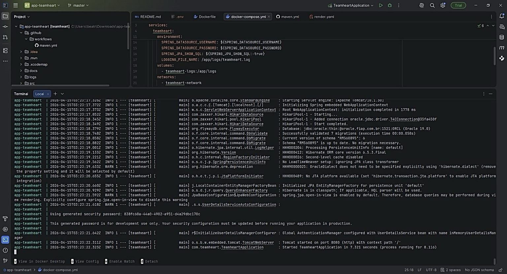

3. A aplicação ficará disponível em:
   - API: `http://localhost:8080`
   - Swagger: `http://localhost:8080/swagger-ui/index.html`

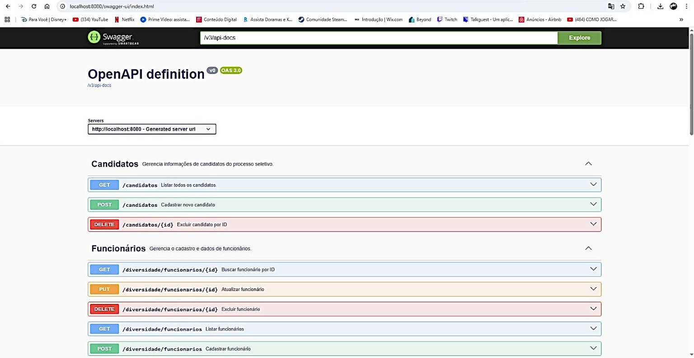

### Observações importantes
- O projeto utiliza banco Oracle externo da disciplina, por isso o `docker-compose.yml` orquestra a aplicação e a configuração do ambiente, sem subir um banco local.
- Os logs da aplicação são persistidos em volume Docker nomeado: `teamheart-logs`.
- A rede do serviço é criada explicitamente como `teamheart-network`.

## Pipeline CI/CD

A automação foi implementada com **GitHub Actions**.

### Ferramenta utilizada
- GitHub Actions
- Render para hospedagem dos ambientes reais
- Docker para empacotamento da aplicação

### Etapas do pipeline

1. **Build**
   - Checkout do repositório
   - Configuração do Java 21
   - Execução de `./mvnw -B clean verify`
   - Geração do artefato `.jar`

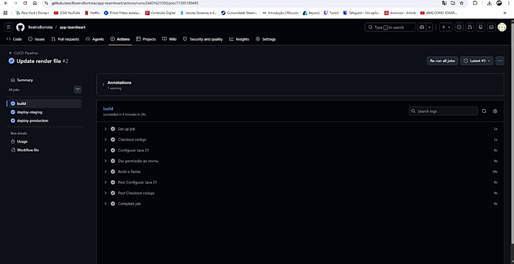

2. **Deploy em staging**
   - Disparo do **Deploy Hook** do Render para o serviço `teamheart-staging`
   - Publicação automática do ambiente de staging no Render

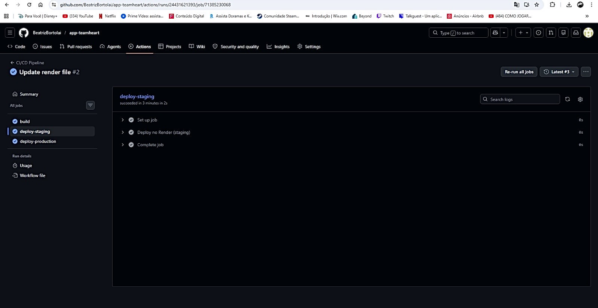

3. **Deploy em produção**
   - Disparo do **Deploy Hook** do Render para o serviço `teamheart-production`
   - Publicação automática do ambiente de produção no Render

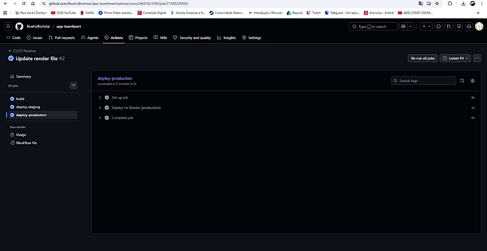

### Funcionamento do pipeline

O pipeline é acionado automaticamente a cada push na branch principal.

O fluxo de execução ocorre da seguinte forma:
- Inicialmente é realizado o build e a execução dos testes automatizados com Maven
- Em seguida, o deploy é feito automaticamente no ambiente de staging
- Por fim, o pipeline realiza o deploy no ambiente de produção

O workflow foi separado em três jobs:
- um job de integração contínua (`build`)
- um job de deploy real para **staging** via Render Deploy Hook
- um job de deploy real para **production** via Render Deploy Hook

### Execução completa do pipeline

A imagem abaixo apresenta a execução completa do pipeline CI/CD no GitHub Actions, evidenciando o fluxo automatizado entre as etapas.

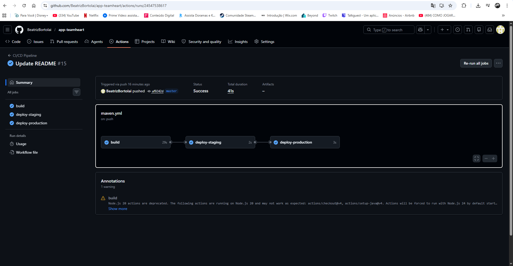

---

### Configuração do pipeline

O pipeline foi definido no arquivo `.github/workflows/maven.yml`, onde são especificadas as etapas de build, testes e deploy.

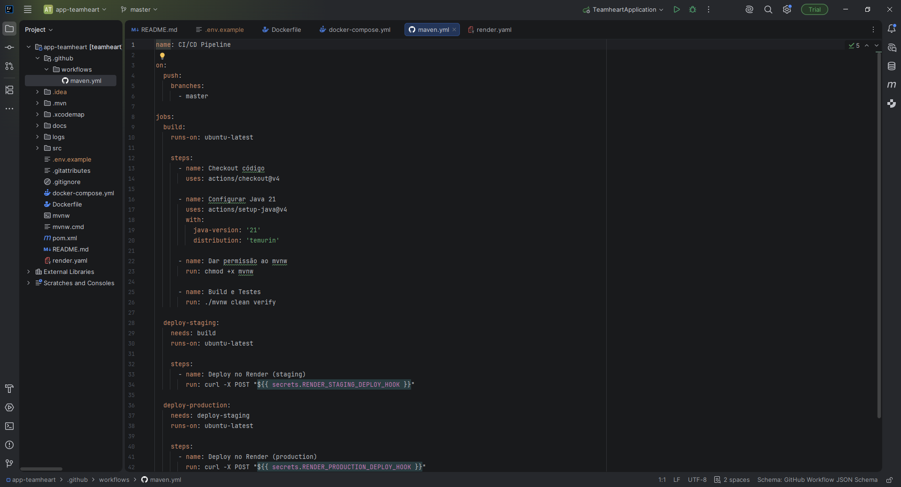

## Deploy real no Render

Este projeto foi preparado para **deploy real** no Render com dois ambientes:
- `teamheart-staging`
- `teamheart-production`

### Ambiente staging no Render

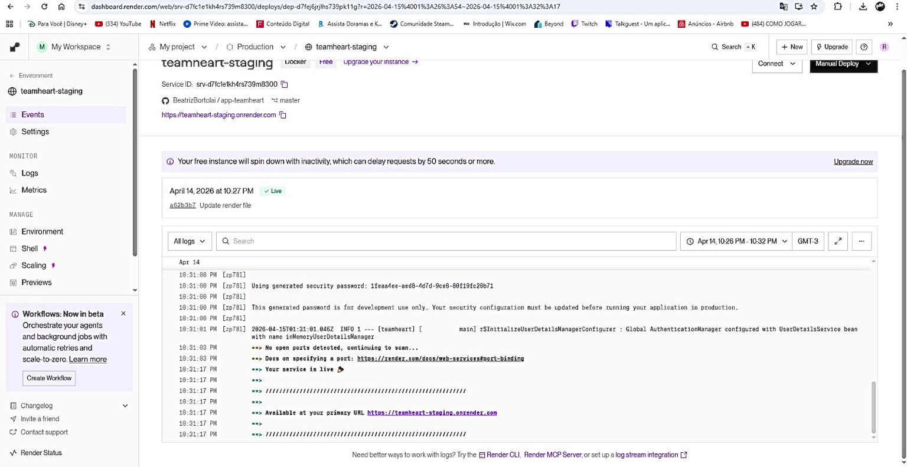

### Swagger staging

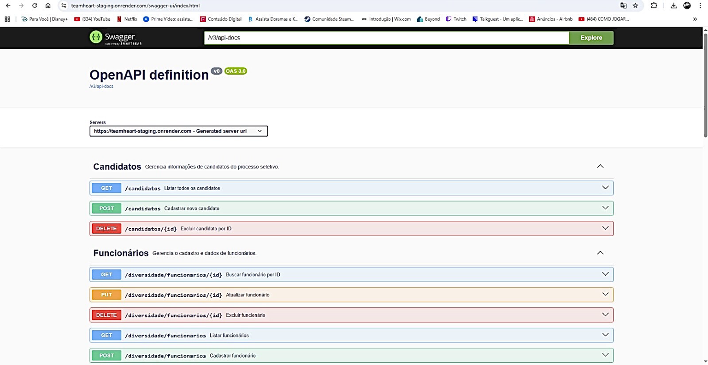

### Ambiente produção no Render

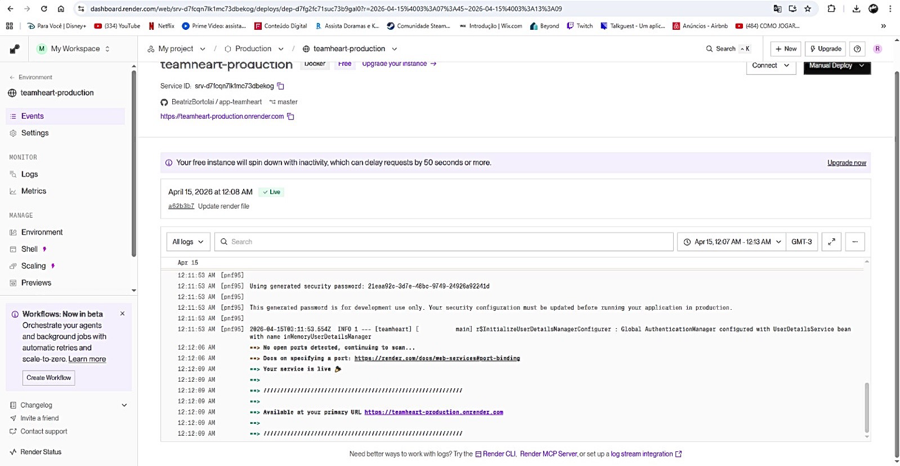

### Swagger produção

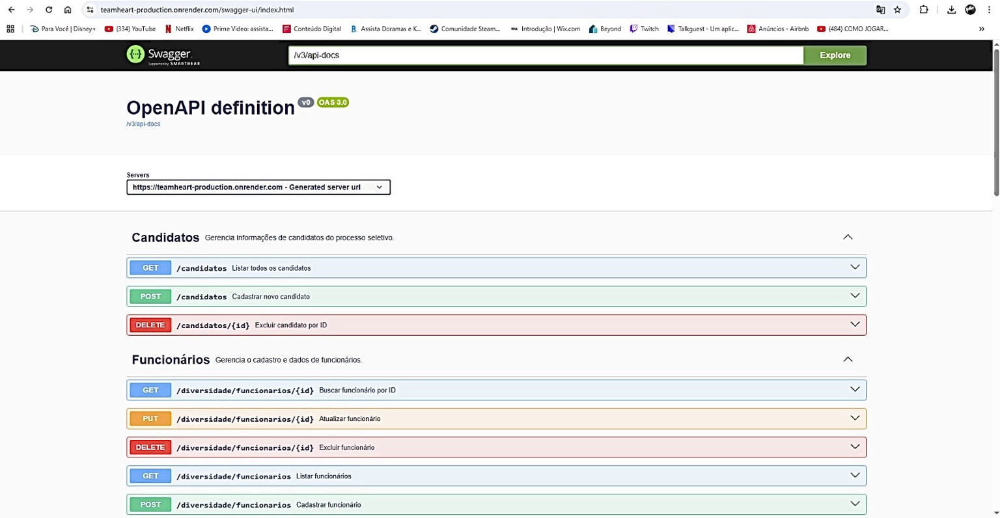

### Arquivos adicionados
- `render.yaml`: define os dois serviços web no Render
- `.github/workflows/maven.yml`: dispara os deploy hooks de staging e produção

### Configuração do deploy (GitHub e Render)

O deploy automatizado foi configurado utilizando integração entre GitHub Actions e Render.

No GitHub, foram utilizados secrets para armazenar os deploy hooks de cada ambiente:
- `RENDER_STAGING_DEPLOY_HOOK`
- `RENDER_PRODUCTION_DEPLOY_HOOK`

Esses hooks são responsáveis por acionar o deploy automático no Render durante a execução do pipeline.

No Render, cada ambiente possui variáveis de ambiente próprias, incluindo:
- `SPRING_DATASOURCE_URL`
- `SPRING_DATASOURCE_USERNAME`
- `SPRING_DATASOURCE_PASSWORD`
- `SERVER_PORT`

### Observação importante

O Render não utiliza `docker-compose.yml` diretamente para publicação dos serviços.  
Para o deploy, foi utilizado o arquivo `render.yaml`, que define os serviços da aplicação utilizando o conceito de **Blueprints**.

A aplicação é construída a partir do `Dockerfile` e configurada por meio de variáveis de ambiente no próprio painel do Render, permitindo a separação entre os ambientes de **staging** e **produção**.

## Containerização
### Containers em execução

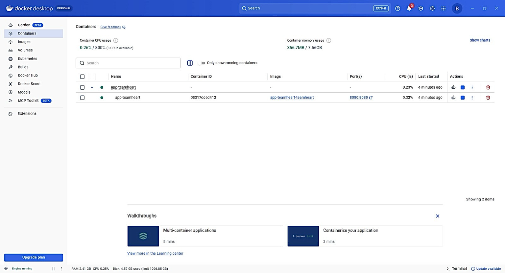

### Estrategia do Dockerfile
O projeto utiliza **multi-stage build**:
- **Stage 1:** compila e empacota a aplicação com Maven
- **Stage 2:** executa apenas o `.jar` final em imagem Java 21 mais enxuta

### Dockerfile utilizado
```dockerfile
FROM maven:3.9.9-eclipse-temurin-21 AS build
WORKDIR /app
COPY .mvn .mvn
COPY mvnw pom.xml ./
RUN chmod +x mvnw && ./mvnw dependency:go-offline -B
COPY src ./src
RUN ./mvnw clean package -DskipTests

FROM eclipse-temurin:21-jre
WORKDIR /app
COPY --from=build /app/target/*.jar app.jar
EXPOSE 8080
ENTRYPOINT ["java", "-jar", "app.jar"]
```

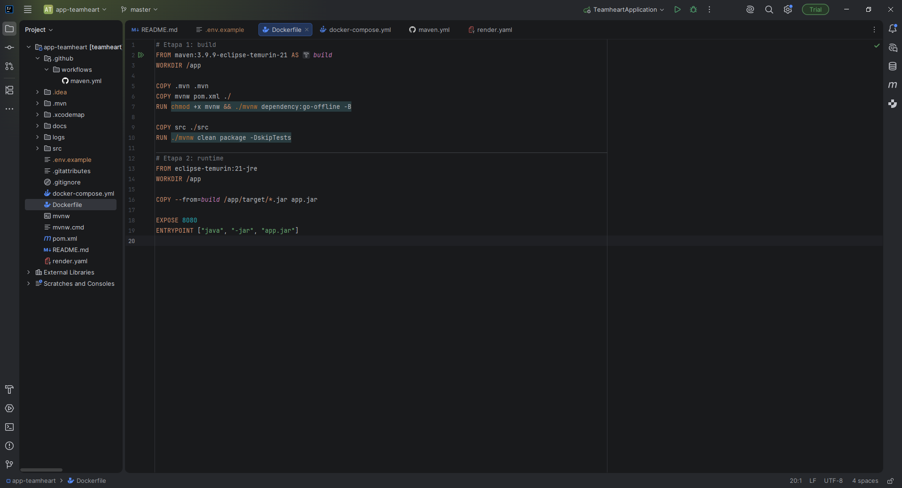

### Docker Compose
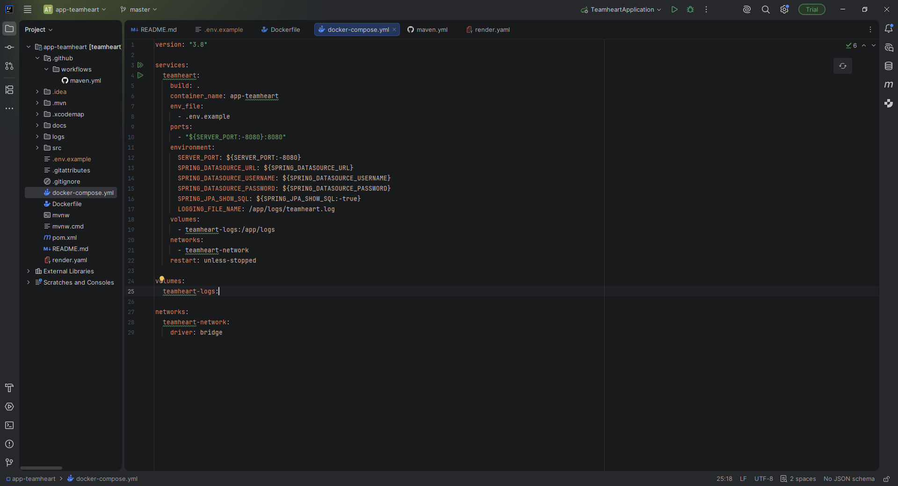

### Estrategias adotadas
- Multi-stage build para reduzir a imagem final
- Externalização de segredos via `.env`
- Aplicação exposta localmente na porta 8080
- Volume nomeado para logs
- Rede Docker explicita
- Separação dos ambientes `staging` e `production` via Render e variáveis de ambiente

## Tecnologias utilizadas

- Java 21
- Spring Boot 3.3.4
- Spring Web
- Spring Data JPA
- Spring Security
- Spring Validation
- Oracle Database
- Flyway
- Swagger / OpenAPI
- Maven Wrapper
- Docker
- Docker Compose
- GitHub Actions
- Render
- JUnit 5
- Mockito
- **Cucumber** (BDD Framework)
- **RestAssured** (API Testing)
- **JSON Schema Validation**

# Configuração e Execução dos Testes Automatizados (BDD)

## Pré-requisitos

Antes de executar os testes, é necessário possuir instalado:

- Java 21 ou superior
- Maven
- Docker (para testes em containers)
- Docker Compose

---

## Configuração do Projeto

### 1. Clonar o repositório
```bash
git clone <URL_DO_REPOSITORIO>
```

### 2. Acessar a pasta do projeto
```bash
cd app-teamheart
```

### 3. Instalar dependências
```bash
mvn clean install
```

---

## Executando a Aplicação

### Subir aplicação Spring Boot localmente
```bash
mvn spring-boot:run
```

A aplicação ficará disponível em:
- API: `http://localhost:8080`
- Swagger: `http://localhost:8080/swagger-ui/index.html`

### Subir com Docker Compose
```bash
docker compose up --build
```

---

## Executando os Testes Automatizados (BDD com Cucumber)

### Opção 1: Executar testes localmente com Maven

Execute todos os testes (incluindo BDD, unitários e de integração):
```bash
mvn clean test
```

Execute apenas os testes BDD (Cucumber):
```bash
mvn clean test -Dtest=RunCucumberTest
```

### Opção 2: Executar testes com Docker

Build da imagem com testes:
```bash
docker build -t teamheart-tests .
```

Executar container com testes:
```bash
docker run teamheart-tests
```

---

## Cenários de Teste BDD Implementados

### Funcionalidade 1: Autenticação de Usuários
- **Arquivo:** `src/test/resources/features/login.feature`
- **Cenários:**
  - ✅ Login com sucesso - Valida autenticação com credenciais corretas
  - Validação de status code 200
  - Validação de contrato JSON Schema
  - Validação de mensagem de sucesso

- **Arquivo:** `src/test/resources/features/login-invalido.feature`
- **Cenários:**
  - ✅ Login inválido - Rejeita credenciais incorretas
  - Validação de status code 400
  - Validação de mensagem de erro

### Funcionalidade 2: Cadastro de Usuários
- **Arquivo:** `src/test/resources/features/registro-usuario.feature`
- **Cenários:**
  - ✅ Registrar novo usuário com sucesso - Cria novo usuário
  - Validação de status code 201
  - ✅ Rejeitar email duplicado - Previne duplicação de emails
  - Validação de status code 409
  - Testes de compliance ESG (privacidade de dados)

### Funcionalidade 3: Gerenciamento de Candidatos
- **Arquivo:** `src/test/resources/features/cadastro-candidato.feature`
- **Cenários:**
  - ✅ Cadastrar candidato com sucesso - Inclui dados de diversidade
  - Validação de status code 201
  - Validação de contrato JSON Schema (candidato-schema.json)
  - Captura de informações de etnia e gênero para análise ESG
  - ✅ Buscar candidato inexistente - Teste negativo
  - Validação de status code 404

- **Arquivo:** `src/test/resources/features/busca-candidato.feature`
- **Cenários:**
  - ✅ Busca de candidato inexistente
  - Validação de tratamento de erros
  - Validação de status code 404

### Funcionalidade 4: Gestão de Vagas e Seleções
- **Arquivo:** `src/test/resources/features/gestao-vagas-selecoes.feature`
- **Cenários:**
  - ✅ Listar vagas disponíveis
  - Validação de status code 200
  - Validação de contrato JSON Schema (vaga-schema.json)
  - ✅ Criar processo de seleção
  - Validação de status code 201
  - Rastreabilidade para governança ESG

### Funcionalidade 5: Gestão de Diversidade e Feedbacks
- **Arquivo:** `src/test/resources/features/gestao-diversidade-feedbacks.feature`
- **Cenários:**
  - ✅ Listar funcionários cadastrados
  - Validação de status code 200
  - Validação de contrato JSON Schema (funcionario-schema.json)
  - ✅ Registrar feedback de funcionário
  - Validação de status code 201
  - Validação de contrato JSON Schema (feedback-schema.json)
  - Compliance com pilares ESG (inclusão e diversidade)

---

## Estrutura dos Testes

```text
src/test/
├── java/
│   └── com/teamheart/
│       ├── steps/
│       │   ├── ApiSteps.java              # Steps do Cucumber (Given/When/Then)
│       │   └── CucumberSpringConfiguration.java
│       ├── api/
│       │   └── AuthApiTest.java           # Testes de integração de API
│       ├── login/
│       │   └── service/
│       │       └── UsuarioServiceTest.java
│       ├── recrutamento/
│       │   └── service/
│       │       └── SelecaoServiceTest.java
│       └── runner/
│           └── RunCucumberTest.java       # Runner do Cucumber
└── resources/
    ├── features/
    │   ├── login.feature
    │   ├── login-invalido.feature
    │   ├── busca-candidato.feature
    │   ├── cadastro-candidato.feature
    │   ├── registro-usuario.feature
    │   ├── gestao-vagas-selecoes.feature
    │   └── gestao-diversidade-feedbacks.feature
    └── schemas/
        ├── login-success-schema.json
        ├── error-schema.json
        ├── candidato-schema.json
        ├── vaga-schema.json
        ├── selecao-schema.json
        ├── funcionario-schema.json
        └── feedback-schema.json
```

---

## Validações Implementadas

### 1. Status Code Validation ✅
- HTTP 200 (OK)
- HTTP 201 (Created)
- HTTP 400 (Bad Request)
- HTTP 404 (Not Found)
- HTTP 409 (Conflict)

### 2. Body Response Validation ✅
- Validação de campos obrigatórios
- Validação de tipos de dados
- Validação de mensagens de erro

### 3. JSON Schema Contract Testing ✅
Todos os endpoints retornam respostas validadas contra JSON Schemas:
- `login-success-schema.json` - Resposta de login bem-sucedido
- `error-schema.json` - Respostas de erro
- `candidato-schema.json` - Dados de candidatos
- `vaga-schema.json` - Dados de vagas
- `selecao-schema.json` - Dados de seleções
- `funcionario-schema.json` - Dados de funcionários
- `feedback-schema.json` - Dados de feedbacks

---

## Pipeline CI/CD

Os testes são executados automaticamente no GitHub Actions a cada push:

1. **Build Stage** - Compila o código
2. **Test Stage** - Executa todos os testes (BDD + Unitários + Integração)
3. **Deploy Stage** - Faz deploy em staging e produção

Veja `.github/workflows/maven.yml` para mais detalhes.

---

## Alinhamento com ESG (Environmental, Social, Governance)

### Environmental (Ambiental)
- ✅ Otimização de código em testes para reduzir consumo computacional
- ✅ Uso de containers Docker para eficiência de recursos

### Social (Responsabilidade Social)
- ✅ Testes de inclusão e diversidade no cadastro de candidatos
- ✅ Captura de informações de etnia e gênero
- ✅ Testes de acessibilidade de APIs
- ✅ Rastreabilidade de feedbacks para justiça corporativa

### Governance (Governança)
- ✅ Testes de compliance e autenticação
- ✅ Validação de contrato de APIs (JSON Schema)
- ✅ Rastreabilidade de operações críticas
- ✅ Pipeline CI/CD automatizado para garantir qualidade

---


